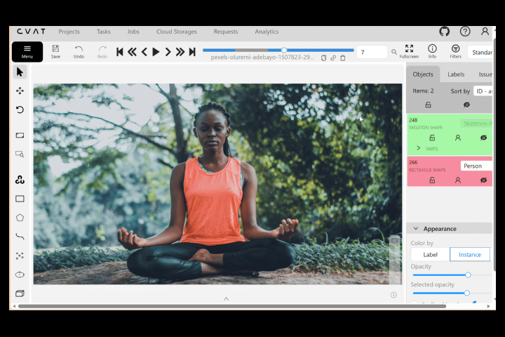

# Body-Landmarks with Skeleton Keypoints



This project demonstrates **manual body landmarks annotation** using **17 keypoints per person** in **CVAT (Computer Vision Annotation Tool)**. The annotations are exported in **COCO JSON format**, where each keypoint is stored with precise **x, y coordinates**. A Python notebook analyzes the exported dataset and produces:

* Dataset statistics
* Keypoint validation
* Distribution plots
* A GitHub-ready Markdown report

This project focuses entirely on **annotation accuracy**, **keypoint consistency**, and **dataset-level insights**. **No model training** is included.

---

## Folder Structure

```plaintext
annotations/
└── annotations.json                # COCO JSON point annotations

data/
└── GUIDELINES.md                   # 17-keypoints body landmark annotation guidelines

notebooks/
└── body_landmarks_skeleton.ipynb    # Analysis, validation, statistics, reporting

results/
├── annotations_stats.txt           # Keypoint statistics per image and label
├── eval_summary.txt                # Point validation results
├── category_distribution.png       # Distribution of keypoints across labels
└── report.md                       # GitHub-ready analytical summary

README.md                           # (You are here)
before_after.gif                    # Example body keypoints overlay
```

---

## About the GIF (Before vs After Annotation)

The **before-after.gif** demonstrates the annotation process for body landmarks, where:

* The **before** image shows the original, unannotated image.
* The **after** image overlays the **17 body keypoints** on the image, highlighting the **skeleton structure**.

This visual helps to understand the **keypoint annotation style** and **skeleton consistency** across the dataset.

---

## Tools Used

| Tool / Component     | Purpose                                    |
| -------------------- | ------------------------------------------ |
| **CVAT**             | Manual body keypoints annotation           |
| **COCO JSON**        | Structured point annotations (COCO format) |
| **Python**           | Dataset parsing, validation, aggregation   |
| **NumPy / Pandas**   | Statistical computations                   |
| **Matplotlib**       | Visual plots & distribution graphs         |
| **Jupyter Notebook** | Reproducible analysis pipeline             |

---

## Dataset Annotation Details

The **Body-Landmarks with Skeleton Keypoints** dataset contains **17 keypoints per body**, annotated manually using **CVAT**. The annotations are exported in **COCO JSON format**, and each annotation includes:

* Image metadata
* 17 keypoints with **x, y coordinates** for each body part
* Label definitions (body landmarks for each person)

The dataset includes **12 annotated images**, fully covering all keypoints per person.

### Example of COCO JSON Format

```json
{
  "images": [
    {
      "file_name": "pexels-adenir-32996801.jpg",
      "height": 1000,
      "width": 1500,
      "id": 1
    }
  ],
  "annotations": [
    {
      "image_id": 1,
      "category_id": 1,
      "keypoints": [x1, y1, v1, x2, y2, v2, ..., x17, y17, v17],
      "num_keypoints": 17
    }
  ]
}
```

---

## Results Generated by the Notebook

Running:

```
notebooks/body_landmarks_analysis.ipynb
```

produces four outputs:

### 1. annotations_stats.txt

```
=== Body Landmarks Annotation Statistics ===

Total Images: 12
Total Annotations (points): 204
Total Labels: 1

--- Annotations per Image ---
pexels-adenir-32996801.jpg: 17 keypoints
pexels-alohaphotostudio-5901240.jpg: 17 keypoints
...

--- Invalid Annotations (out-of-bound points) ---
Invalid Annotations (out-of-bound): 0
```

### 2. eval_summary.txt

```
=== Evaluation Summary (Point Quality Checks) ===

Invalid Annotations (out-of-bound): 0
Mean points per image: 17.00
Median points per image: 17.00
Max points per image: 17.00
```

### 3. category_distribution.png

This plot shows the **distribution of keypoints** across the images, helping to ensure consistent annotation and detect any skewed distributions.


### 4. report.md

A Markdown report summarizing:

* Total images, total keypoints, total labels
* Per-label keypoint counts
* Per-image keypoint counts
* Validation summaries

This report is ready for GitHub, documentation, or dataset audit records.

---

## Annotation Guidelines

The full annotation guidelines used for body landmark creation are documented in:

```
data/GUIDELINES.md
```

This document includes:

* Keypoint placement rules for each body part
* Handling of occlusions and partial visibility
* Consistency across multiple people
* Handling difficult poses or angles

---

## About the Project

This project demonstrates:

* Manual annotation of **17 body keypoints** per person using **CVAT**.
* Exporting the annotations in **COCO JSON format**.
* Running Python-based analysis for **data validation** and **statistical insights**.
* Consistent **skeleton structure annotation**.

The project does **not** involve model training. The focus is entirely on the **accuracy** and **quality** of annotations and the **statistical analysis** of the dataset.

---

## Author

Karan Heera

GitHub: [https://github.com/karanheera](https://github.com/karanheera)
LinkedIn: [https://linkedin.com/in/karanheera](https://linkedin.com/in/karanheera)

---

## Special Thanks & Image Credits

Images sourced from:

* Pexels — [https://www.pexels.com](https://www.pexels.com)

Used strictly under their respective free-to-use licenses for non-commercial annotation research and educational purposes.

