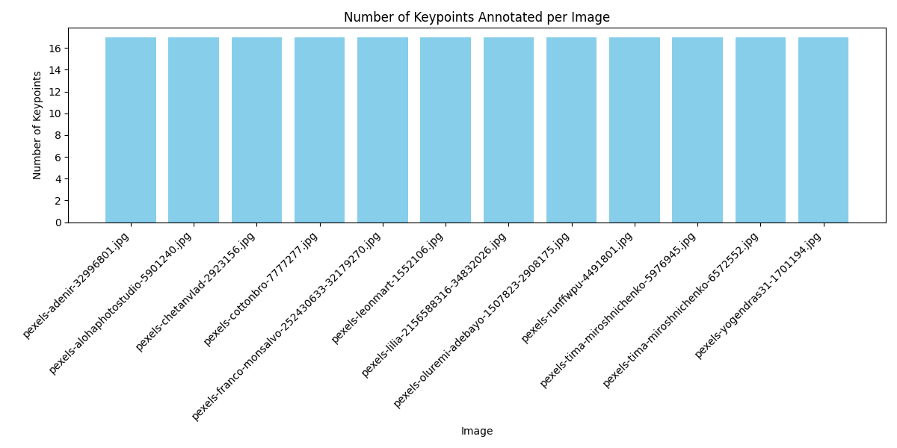

# Body Landmarks Annotation Report
Generated automatically from annotations.

## Dataset Summary
- **Images:** 12
- **Annotations (Points):** 204
- **Total Labels:** 1

## Annotation Quality Checks
- Invalid Annotations (out-of-bound points): **0**

## Keypoints Distribution per Image

## Notes
- Analyzed annotations for **body landmarks**.
- No skeleton visualization performed.
