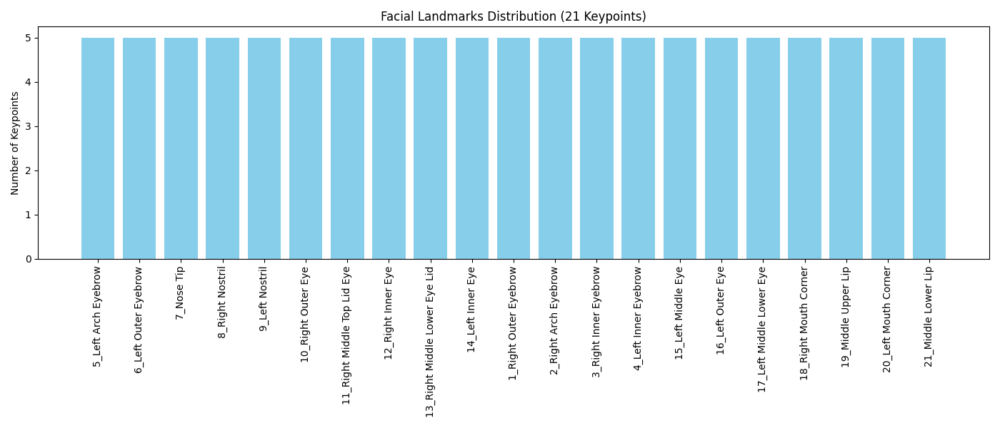

# Facial Landmarks 21-Keypoints Annotation


This subproject demonstrates **manual facial keypoint annotation with 21 points per face**, created in **CVAT (Computer Vision Annotation Tool)**.

The dataset is exported in **CVAT XML format**, where each keypoint represents a specific facial landmark (eyebrows, eyes, nose, mouth).  
A Python notebook analyzes the exported dataset and produces:

* Dataset statistics
* Keypoint quality validation
* Distribution plots
* A GitHub-ready Markdown report

This project focuses entirely on **annotation quality**, **keypoint completeness**, and **dataset-level insights**. No model training is included.

---

## Folder Structure

```plaintext
annotations/
└── annotations.xml                  # CVAT XML point annotations (21 keypoints per face)

data/
└── GUIDELINES.md                    # Facial landmarks 21-keypoints annotation guidelines

notebooks/
└── facial_landmarks_21kp.ipynb      # Analysis, validation, statistics, reporting

results/
├── annotations_stats.txt            # Keypoint statistics per image and label
├── eval_summary.txt                 # Keypoint quality validation results
├── category_distribution_21kp.png  # Label distribution bar chart
└── report.md                        # GitHub-ready analytical summary

README.md                            # (You are here)
before_after.gif                     # Example facial landmarks visualization
````

---

## Dataset Summary

From `annotations.xml`, the dataset contains:

* **Images:** 5
* **Annotations (points):** 105
* **Labels (keypoints):** 21

### Annotations per Image

```
1.jpg: 21
2.jpg: 21
3.jpg: 21
4.jpg: 21
5.jpg: 21
```

### Annotations per Label

```
5_Left Arch Eyebrow: 5
6_Left Outer Eyebrow: 5
7_Nose Tip: 5
8_Right Nostril: 5
9_Left Nostril: 5
10_Right Outer Eye: 5
11_Right Middle Top Lid Eye: 5
12_Right Inner Eye: 5
13_Right Middle Lower Eye Lid: 5
14_Left Inner Eye: 5
1_Right Outer Eyebrow: 5
2_Right Arch Eyebrow: 5
3_Right Inner Eyebrow: 5
4_Left Inner Eyebrow: 5
15_Left Middle Eye: 5
16_Left Outer Eye: 5
17_Left Middle Lower Eye: 5
18_Right Mouth Corner: 5
19_Middle Upper Lip: 5
20_Left Mouth Corner: 5
21_Middle Lower Lip: 5
```

### Invalid Annotations

No invalid annotations (all keypoints are present and within image bounds).

---

## Evaluation Summary (Point Quality Checks)

```
Invalid Annotations (missing/out-of-bound): 0
Mean points per image: 21.00
Median points per image: 21.00
Max points per image: 21.00
```

These checks confirm the **structural validity** of all facial keypoint annotations.

---

## Distribution Plot

A visualization showing **annotation count per label**:



Provides a quick overview of dataset balance and labeling consistency.

---

## Annotation Guidelines

The full annotation rules used for keypoint creation are documented in:

```
data/GUIDELINES.md
```

It includes:

* Definitions for all 21 facial landmarks
* Keypoint placement rules for eyebrows, eyes, nose, and mouth
* Handling occlusions and difficult poses
* Consistency standards across images and faces

---

## About the Project

This facial landmarks project demonstrates:

* Accurate manual keypoint annotation across **5 images**
* Experience with **CVAT XML point exports**
* Custom dataset validation and statistics pipeline
* Consistent labeling for 21 facial landmarks
* Fully reproducible workflow using **Jupyter Notebook**
* Focused entirely on annotation quality — no models are trained

---

## Author

Karan Heera

GitHub: [https://github.com/karanheera](https://github.com/karanheera)
LinkedIn: [https://linkedin.com/in/karanheera](https://linkedin.com/in/karanheera)

---

## Summary

This repository showcases:

* Manual facial keypoint annotation proficiency
* Understanding of CVAT XML structure for point annotations
* Dataset validation and quality checks
* Statistical breakdown of 21 facial keypoints
* Documentation and reporting best practices

Suitable for **research, dataset creation, or annotation portfolio demonstration**.

---

## Special Thanks & Image Credits

Images sourced from:

* Pexels — [https://www.pexels.com](https://www.pexels.com)

Used strictly under their respective free-to-use licenses for non-commercial annotation research and educational purposes.

