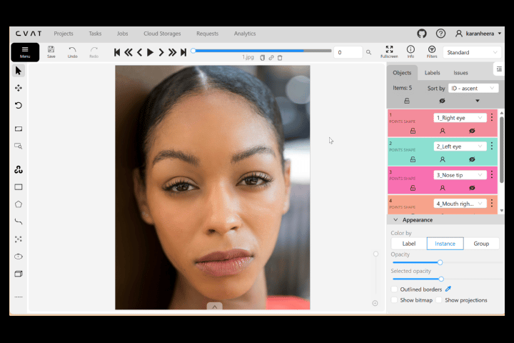
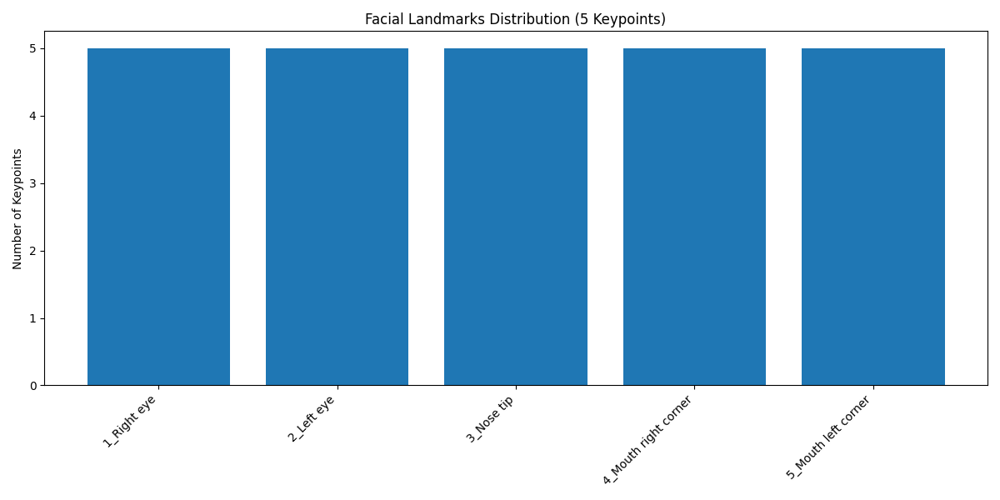

Here’s a complete **`README.md`** for your **Facial-Landmarks 5-Keypoints Annotation** project, following the same style as your previous projects:

---

# Facial Landmarks (5-Keypoints) Annotation



This project demonstrates **manual facial landmarks annotation** using **5 keypoints per face** in **CVAT (Computer Vision Annotation Tool)**.

The annotations are exported in **CVAT XML format**, where each keypoint is stored with precise **x, y coordinates**.
A Python notebook analyzes the exported dataset and produces:

* Dataset statistics
* Keypoint validation
* Distribution plots
* A GitHub-ready Markdown report

This project focuses entirely on **annotation accuracy**, **keypoint consistency**, and **dataset-level insights**.
No model training is included.

---

## Folder Structure

```plaintext
annotations/
└── annotations.xml                 # CVAT XML point annotations

data/
└── GUIDELINES.md                   # 5-keypoints facial landmark annotation guidelines

notebooks/
└── facial_landmarks_5kp.ipynb      # Analysis, validation, statistics, reporting

results/
├── annotations_stats.txt      # Keypoint statistics per image and label
├── eval_summary.txt                # Point validation results
├── category_distribution.png       # Distribution of keypoints across labels
└── report.md                       # GitHub-ready analytical summary

README.md                            # (You are here)
before_after.gif                     # Example facial keypoints overlay
```

---

## About the GIF (Example Keypoints)

The preview demonstrates:

* Annotated facial keypoints over the original image
* 5 keypoints per face:

  * Right eye
  * Left eye
  * Nose tip
  * Mouth right corner
  * Mouth left corner

It represents the annotation style and consistency followed throughout the dataset.

---

## Tools Used

| Tool / Component | Purpose                                  |
| ---------------- | ---------------------------------------- |
| CVAT             | Manual facial keypoints annotation       |
| CVAT XML Format  | Structured point annotations             |
| Python           | Dataset parsing, validation, aggregation |
| NumPy / Pandas   | Statistical computations                 |
| Matplotlib       | Visual plots & distribution graphs       |
| Jupyter Notebook | Reproducible analysis pipeline           |

---

## Dataset Annotation Details

All annotations were created manually in CVAT using **5-point facial landmark labeling**.
The final export is a **CVAT XML** file containing:

* Image metadata
* Keypoints with coordinates
* Label definitions (5 keypoints per face)

The dataset includes **5 annotated images**, fully covering all keypoints per face.

The annotation file is located at:

```
annotations/annotations.xml
```

---

## Results Generated by the Notebook

Running:

```
notebooks/facial_landmarks_5kp.ipynb
```

produces four outputs.

### 1. facial_landmarks_stats.txt

```
=== Facial Landmarks Annotation Statistics ===

Total Images: 5
Total Annotations (points): 25
Total Labels: 5

--- Annotations per Image ---
1.jpg: 5
2.jpg: 5
3.jpg: 5
4.jpg: 5
5.jpg: 5

--- Annotations per Label ---
1_Right eye: 5
2_Left eye: 5
3_Nose tip: 5
4_Mouth right corner: 5
5_Mouth left corner: 5

--- Invalid Annotations (missing or out-of-bound points) ---
```

### 2. eval_summary.txt

```
=== Evaluation Summary (Point Quality Checks) ===

Invalid Annotations (missing/out-of-bound): 0
Mean points per image: 5.00
Median points per image: 5.00
Max points per image: 5.00
```

### 3. category_distribution.png

A combined visualization showing:

* Number of keypoints per label
* Ensures consistent annotation across all faces



### 4. report.md

A finalized Markdown report summarizing:

* Total images, total keypoints, total labels
* Per-label keypoint counts
* Per-image keypoint counts
* Validation summaries
* Embedded distribution figure

Useful for GitHub, documentation, or dataset audit records.

---

## Annotation Guidelines

The full annotation rules used for facial landmark creation are documented in:

```
data/GUIDELINES.md
```

This includes:

* Placement rules for each keypoint
* Occlusion handling
* Consistency across multiple faces
* Guidelines for difficult poses or partial visibility

---

## About the Project

This facial landmarks project demonstrates:

* Accurate **5-point facial landmark annotation** across 5 images
* Experience with **CVAT XML point annotations**
* Custom dataset validation and statistics pipelines
* Consistent keypoint annotation
* No model training — purely manual annotation quality
* Fully reproducible workflows using Jupyter

---

## Author

Karan Heera

GitHub: [https://github.com/karanheera](https://github.com/karanheera)
LinkedIn: [https://linkedin.com/in/karanheera](https://linkedin.com/in/karanheera)

---

## Summary

This repository showcases:

* Manual 5-keypoint facial landmark annotation
* Understanding of CVAT XML structures for point annotations
* Dataset validation and quality checks
* Statistical dataset breakdowns
* Documentation and reporting best practices

A complete annotation-only workflow suitable for research, dataset creation, or annotation portfolio demonstration.

---

## Special Thanks & Image Credits

Images sourced from:

* Pexels — [https://www.pexels.com](https://www.pexels.com)

Used strictly under their respective free-to-use licenses for non-commercial annotation research and educational purposes.

