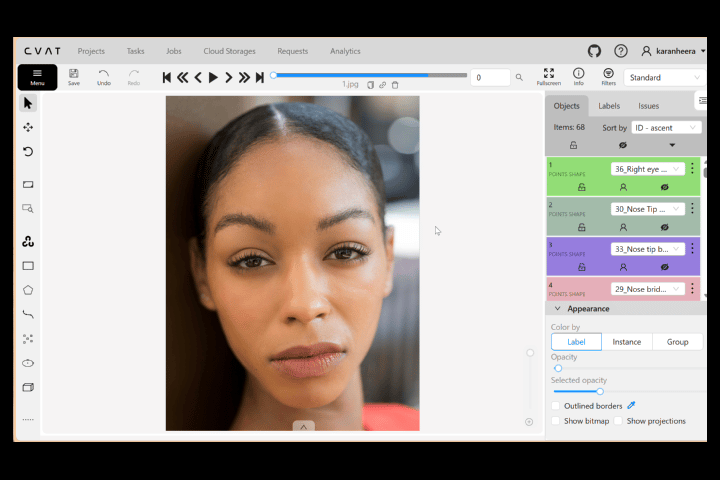
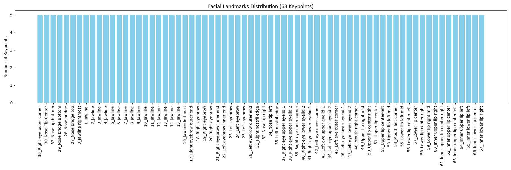

# Facial Landmarks 68-Keypoints Annotation



This subproject demonstrates **manual facial keypoint annotation with 68 points per face**, created in **CVAT (Computer Vision Annotation Tool)**.

The dataset is exported in **CVAT XML format**, where each keypoint represents a specific facial landmark (jawline, eyebrows, eyes, nose, mouth, lips).
A Python notebook analyzes the exported dataset and produces:

* Dataset statistics
* Keypoint quality validation
* Distribution plots
* A GitHub-ready Markdown report

This project focuses entirely on **annotation quality**, **keypoint completeness**, and **dataset-level insights**. No model training is included.

---

## Folder Structure

```plaintext
annotations/
└── annotations.xml                  # CVAT XML point annotations (68 keypoints per face)

data/
└── GUIDELINES.md                    # Facial landmarks 68-keypoints annotation guidelines

notebooks/
└── facial_landmarks_68kp.ipynb      # Analysis, validation, statistics, reporting

results/
├── annotations_stats.txt            # Keypoint statistics per image and label
├── eval_summary.txt                 # Keypoint quality validation results
├── category_distribution_68kp.png   # Label distribution bar chart
└── report.md                        # GitHub-ready analytical summary

README.md                            # (You are here)
before_after.gif                     # Example facial landmarks visualization
```

---

## Dataset Summary

From `annotations.xml`, the dataset contains:

* **Images:** 5
* **Annotations (points):** 340
* **Labels (keypoints):** 68

### Annotations per Image

```
1.jpg: 68
2.jpg: 68
3.jpg: 68
4.jpg: 68
5.jpg: 68
```

### Annotations per Label

```
36_Right eye outer corner: 5
30_Nose Tip Center: 5
33_Nose tip bottom: 5
29_Nose bridge Bottom: 5
28_Nose bridge: 5
27_Nose bridge top: 5
0_Jawline rightmost: 5
1_Jawline: 5
2_Jawline: 5
3_Jawline: 5
4_Jawline: 5
5_Jawline: 5
6_Jawline: 5
7_Jawline: 5
8_Jawline: 5
9_Jawline: 5
10_Jawline: 5
11_Jawline: 5
12_Jawline: 5
13_Jawline: 5
14_Jawline: 5
15_Jawline: 5
16_Jawline leftmost: 5
17_Right eyebrow outer end: 5
18_Right eyebrow: 5
19_Right eyebrow: 5
20_Right eyebrow: 5
21_Right eyebrow inner end: 5
22_Left eyebrow inner end: 5
23_Left eyebrow: 5
24_Left eyebrow: 5
25_Left eyebrow: 5
26_Left eyebrow outer end: 5
31_Right nostril edge: 5
32_Nose tip right: 5
34_Nose tip left: 5
35_Left nostril edge: 5
37_Right eye upper eyelid 1: 5
38_Right eye upper eyelid 2: 5
39_Right eye inner corner: 5
40_Right eye lower eyelid 2: 5
41_Right eye lower eyelid 1: 5
42_Left eye inner corner: 5
43_Left eye upper eyelid 1: 5
44_Left eye upper eyelid 2: 5
45_Left eye outer corner: 5
46_Left eye lower eyelid 1: 5
47_Left eye lower eyelid 2: 5
48_Mouth right corner: 5
49_Upper lip right mid: 5
50_Upper lip center-right: 5
51_Upper lip center: 5
52_Upper lip center-left: 5
53_Upper lip left mid: 5
54_Mouth left corner: 5
55_Lower lip left mid: 5
56_Lower lip center-left: 5
57_Lower lip center: 5
58_Lower lip center-right: 5
59_Lower lip right mid: 5
60_Inner upper lip right: 5
61_Inner upper lip center-right: 5
62_Inner upper lip center: 5
63_Inner upper lip center-left: 5
64_Inner upper lip left: 5
65_Inner lower lip left: 5
66_Inner lower lip center: 5
67_Inner lower lip right: 5
```

### Invalid Annotations

No invalid annotations (all keypoints are present and within image bounds).

---

## Evaluation Summary (Point Quality Checks)

```
Invalid Annotations (missing/out-of-bound): 0
Mean points per image: 68.00
Median points per image: 68.00
Max points per image: 68.00
```

These checks confirm the **structural validity** of all facial keypoint annotations.

---

## Distribution Plot

A visualization showing **annotation count per label**:



Provides a quick overview of dataset balance and labeling consistency.

---

## Annotation Guidelines

The full annotation rules used for keypoint creation are documented in:

```
data/GUIDELINES.md
```

It includes:

* Definitions for all 68 facial landmarks
* Keypoint placement rules for jawline, eyebrows, eyes, nose, mouth, and lips
* Handling occlusions and difficult poses
* Consistency standards across images and faces

---

## About the Project

This facial landmarks project demonstrates:

* Accurate manual keypoint annotation across **5 images**
* Experience with **CVAT XML point exports**
* Custom dataset validation and statistics pipeline
* Consistent labeling for 68 facial landmarks
* Fully reproducible workflow using **Jupyter Notebook**
* Focused entirely on annotation quality — no models are trained

---

## Author

Karan Heera

GitHub: [https://github.com/karanheera](https://github.com/karanheera)
LinkedIn: [https://linkedin.com/in/karanheera](https://linkedin.com/in/karanheera)

---

## Summary

This repository showcases:

* Manual facial keypoint annotation proficiency
* Understanding of CVAT XML structure for point annotations
* Dataset validation and quality checks
* Statistical breakdown of 68 facial keypoints
* Documentation and reporting best practices

Suitable for **research, dataset creation, or annotation portfolio demonstration**.

---

## Special Thanks & Image Credits

Images sourced from:

* Pexels — [https://www.pexels.com](https://www.pexels.com)

Used strictly under their respective free-to-use licenses for non-commercial annotation research and educational purposes.


