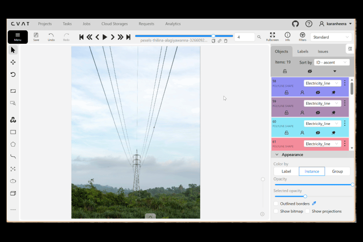

# Line-Segmentation with Polyline Annotations



This subproject demonstrates **manual line segmentation using polyline annotations** created in **CVAT (Computer Vision Annotation Tool)**.

The dataset is exported in **CVAT XML format**, where each line is stored as a **polyline with multiple points**.
A Python notebook analyzes the exported dataset and produces:

* Dataset statistics
* Polyline quality validation
* Distribution plots
* A GitHub-ready Markdown report

This project focuses entirely on **annotation quality**, **line completeness**, and **dataset-level insights**. No model training is included.

---

## Folder Structure

```plaintext
annotations/
└── annotations.xml                  # CVAT XML polyline annotations

data/
└── GUIDELINES.md                    # Line segmentation annotation guidelines

notebooks/
└── line_seg_polyline.ipynb          # Analysis, validation, statistics, reporting

results/
├── annotations_stats.txt            # Polyline statistics per image and label
├── eval_summary.txt                 # Polyline quality validation results
├── category_distribution.png        # Label distribution bar chart
└── report.md                        # GitHub-ready analytical summary

README.md                            # (You are here)
before_after.gif                     # Example line segmentation visualization
```

---

## Dataset Summary

From `annotations.xml`, the dataset contains:

* **Images:** 6
* **Annotations:** 86
* **Labels:** 12

### Annotations per Image

```
pexels-brett-sayles-3459729.jpg: 32
pexels-madsdonald-2739013.jpg: 3
pexels-oficialwallace-23879553.jpg: 20
pexels-starry-moonfairy-2151926846-34802671.jpg: 2
pexels-thilina-alagiyawanna-3266092-34790002.jpg: 19
pexels-zetong-li-880728-13826124.jpg: 10
```

### Annotations per Label

```
Tree_branches: 31
Tree_Stem: 1
Lane_left_boundary: 1
Lane_center_solid: 1
Lane_right_boundary: 1
Crack_line: 20
Rail_track_line: 2
Electricity_line: 19
River_centerline: 10
```

### Invalid Annotations

No invalid annotations (all polylines have points).

---

## Evaluation Summary (Polyline Quality Checks)

```
Invalid annotations: 0
Mean points per polyline: 8.37
Median points per polyline: 6.00
Max points per polyline: 41.00
```

These checks confirm the **structural validity** of all polyline annotations.

---

## Distribution Plot

A combined visualization showing **annotation count per label**:


This provides a quick overview of dataset balance and labeling density.

---

## Annotation Guidelines

The full annotation rules used for polyline creation are documented in:

```
data/GUIDELINES.md
```

It includes:

* How to trace lanes, cracks, rivers, and wires with polylines
* Rules for continuous line completeness
* Occlusion handling
* Label-specific conventions (Lane, Rail, Tree, Electricity lines, etc.)
* Consistency standards across images

---

## About the Project

This polyline segmentation project demonstrates:

* Accurate manual line annotations across **6 diverse images**
* Experience with **CVAT XML polyline exports**
* Custom dataset validation and statistics pipeline
* Consistent labeling for multiple line types (12 labels)
* Fully reproducible workflow using **Jupyter Notebook**
* Focused entirely on annotation quality — no models are trained

---

## Author

Karan Heera

GitHub: [https://github.com/karanheera](https://github.com/karanheera)
LinkedIn: [https://linkedin.com/in/karanheera](https://linkedin.com/in/karanheera)

---

## Summary

This repository showcases:

* Manual polyline annotation proficiency
* Understanding of CVAT XML structure
* Dataset validation and quality checks
* Statistical breakdown of line labels
* Documentation and reporting best practices

Suitable for **research, dataset creation, or annotation portfolio demonstration**.

---

## Special Thanks & Image Credits

Images sourced from:

* Pexels — [https://www.pexels.com](https://www.pexels.com)

Used strictly under their respective free-to-use licenses for non-commercial annotation research and educational purposes.

