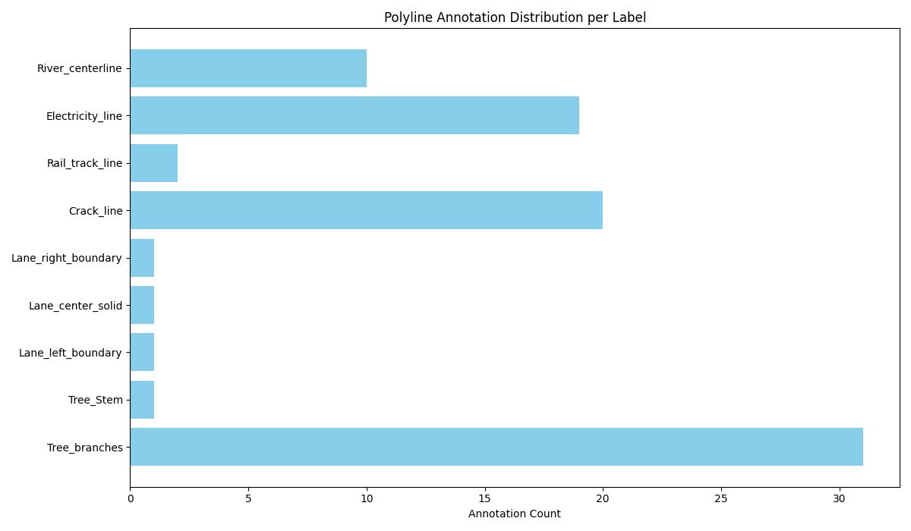

# Line Segmentation Polyline Annotation Report
Generated automatically from CVAT polyline XML annotations.

## Dataset Summary
- **Images:** 6
- **Annotations:** 86
- **Labels:** 12

## Annotation Quality Checks
- Invalid annotations (missing points): **0**

## Distribution Plot

## Notes
- All annotations analyzed are CVAT polyline annotations.
- No images were loaded or displayed.
- No model training performed.
