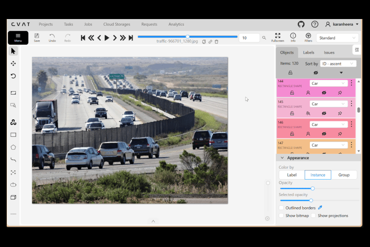
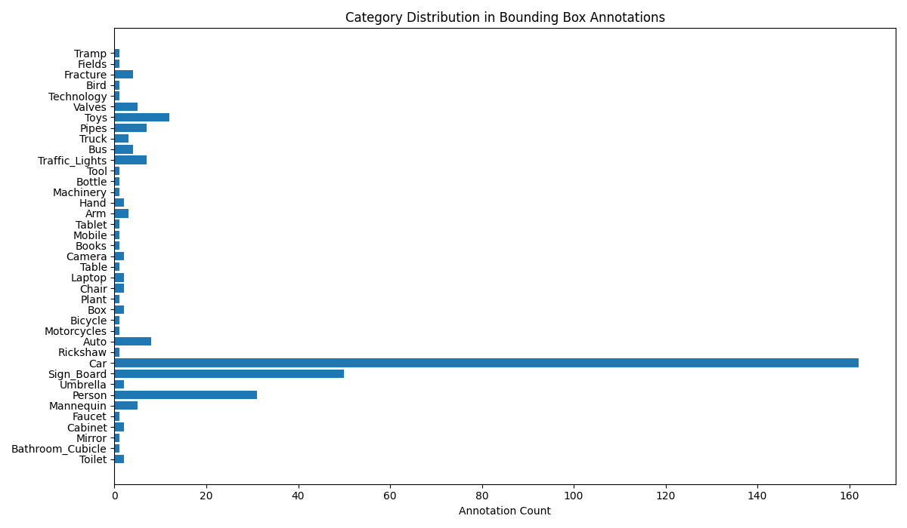

# Object Detection (Bounding Box) Annotation



This subproject demonstrates **manual object detection using bounding box annotations** created in **CVAT (Computer Vision Annotation Tool)**.

The dataset is exported in **COCO bounding box format**, where all objects are stored as **[x, y, width, height] coordinates**.  
A Python notebook analyzes the exported dataset and produces:

* Dataset statistics
* Bounding box quality validation
* Category distribution plots
* A GitHub-ready Markdown report

This project focuses entirely on **annotation quality**, **bbox correctness**, and **dataset-level insights**.  
No model training is included.

---

## Folder Structure

```plaintext
annotations/
└── annotations.json                # COCO-style bounding boxes exported from CVAT

data/
└── GUIDELINES.md                   # Object detection bounding box annotation guidelines

notebooks/
└── obj_detect_bbox.ipynb           # Analysis, validation, statistics, reporting

results/
├── annotations_stats.txt           # Annotation statistics per image and per category
├── eval_summary.txt                # Bounding box validation results
├── category_distribution.png       # Category-wise annotation counts
└── report.md                       # GitHub-ready analytical summary

README.md                           # (You are here)
before_after.gif                # CVAT before/after bounding box preview
````

---

## About the GIF (Before/After Annotation)

The preview demonstrates:

* The original image
* Bounding boxes drawn around objects
* Labels according to category
* Consistent bounding box style across all images

It represents the annotation style and quality maintained throughout the dataset.

---

## Tools Used

| Tool / Component | Purpose                                  |
| ---------------- | ---------------------------------------- |
| CVAT             | Manual bounding box object annotation    |
| COCO BBox Format | Standardized bbox representation         |
| Python           | Dataset parsing, validation, aggregation |
| NumPy / Pandas   | Statistical computations                 |
| Matplotlib       | Visual plots & distribution graphs       |
| Jupyter Notebook | Reproducible analysis pipeline           |

---

## Dataset Annotation Details

All annotations were created manually in CVAT using **bounding box labeling**.
The final export is a **COCO 1.0 JSON** file containing:

* Image metadata
* Category definitions
* Bounding box annotations in COCO `[x, y, width, height]` format

The dataset covers diverse objects, including:

* Indoor objects (furniture, cabinets, mirrors, sinks)
* Vehicles (cars, buses, motorcycles, rickshaws, bicycles, trucks)
* People and body parts (person, hand, arm)
* Signage and tools
* Nature elements (plants, birds)
* Electronics (laptops, tablets, cameras)
* Miscellaneous items (boxes, bottles, toys, valves, machinery)

The annotation file is located at:

```
annotations/annotations.json
```

---

## Results Generated by the Notebook

Running:

```
notebooks/obj_detect_bbox.ipynb
```

produces four outputs.

### 1. annotations_stats.txt

```
=== Annotation Statistics ===

Total Images: 21
Total Annotations: 335
Total Categories: 40

--- Annotations per Image ---
store-9746842_640.jpg: 6
store-window-213496_640.jpg: 5
street-4768502_640.jpg: 15
street-705910_640.jpg: 5
study-789631_640.jpg: 8
technology-791029_640.jpg: 8
tissue-6537455_640.jpg: 4
tools-2209756_640.jpg: 4
traffic-4003342_640.jpg: 9
traffic-7272520_640.jpg: 33
traffic-966701_1280.jpg: 120
tunnel-1845046_640.jpg: 1
valencia-2262321_640.jpg: 70
vanessa-bucceri-gDiRwIYAMA8-unsplash.jpg: 12
wheel-2137043_640.jpg: 11
woman-1845517_640.jpg: 3
x-ray-image-568241_640.jpg: 1
xray-x-ray-2764828_640.jpg: 3
yoga-1146277_640.jpg: 1
young-corn-6312192_640.jpg: 1
zagreb-2582608_640.jpg: 15

--- Annotations per Category ---
Toilet: 2
Bathroom_Cubicle: 1
Mirror: 1
Cabinet: 2
Faucet: 1
Mannequin: 5
Person: 31
Umbrella: 2
Sign_Board: 50
Car: 162
Rickshaw: 1
Auto: 8
Motorcycles: 1
Bicycle: 1
Box: 2
Plant: 1
Chair: 2
Laptop: 2
Table: 1
Camera: 2
Books: 1
Mobile: 1
Tablet: 1
Arm: 3
Hand: 2
Machinery: 1
Bottle: 1
Tool: 1
Traffic_Lights: 7
Bus: 4
Truck: 3
Pipes: 7
Toys: 12
Valves: 5
Technology: 1
Bird: 1
Fracture: 4
Fields: 1
Tramp: 1

--- Zero Area BBoxes ---
None

--- Invalid Annotations ---
None
```

### 2. eval_summary.txt

```
=== Evaluation Summary (Bounding Box Quality Checks) ===

Zero area annotations: 0
Invalid annotations: 0
Mean bbox area: 55839.77
Median bbox area: 809.36
Max bbox area: 3400941.90
```

These checks ensure all bounding boxes are structurally valid.

### 3. category_distribution.png

A horizontal bar plot showing the number of annotations per category.
It helps visualize dataset balance and category representation.



### 4. report.md

A Markdown report summarizing:

* Total images, annotations, and categories
* Per-category annotation counts
* Per-image annotation counts
* Bounding box area statistics
* Validation summaries
* Embedded distribution figure

Useful for GitHub, dataset audit, or documentation.

---

## Annotation Guidelines

The full rules used for bounding box creation are documented in:

```
data/GUIDELINES.md
```

This includes:

* How to draw tight boxes around objects
* Visible-only annotation policy
* Handling occlusions and overlapping objects
* Consistency rules for labeling
* Small-object and extreme aspect-ratio handling
* Category definitions and hierarchy

---

## Example Visualization

From `results/category_distribution.png`, the summary plot reveals:

* Categories with high representation (Car, Sign_Board, Person, Traffic-heavy objects)
* Sparse categories (Rickshaw, Motorcycles, Bird, Fields)
* Variation in per-image annotation density (some images have 1 bbox, others >100)

---

## About the Project

This object detection project demonstrates:

* Accurate bounding box annotation across 21 images
* Experience with COCO bbox exports
* Custom dataset validation and statistics pipelines
* Consistent multi-class object annotation
* No model dependency — purely manual annotation quality
* Reproducible workflows using Jupyter Notebook

---

## Author

Karan Heera

GitHub: [https://github.com/karanheera](https://github.com/karanheera)
LinkedIn: [https://linkedin.com/in/karanheera](https://linkedin.com/in/karanheera)

---

## Summary

This repository showcases:

* Manual object detection proficiency
* Understanding of COCO bbox structures
* Dataset validation and quality checks
* Statistical dataset breakdowns
* Documentation and reporting best practices

---

## Special Thanks & Image Credits

Images sourced from:

* Pexels — [https://www.pexels.com](https://www.pexels.com)
* Pixabay — [https://pixabay.com](https://pixabay.com)
* Unsplash — [https://unsplash.com](https://unsplash.com)

Used under their respective free-to-use licenses for non-commercial annotation research and educational purposes.
