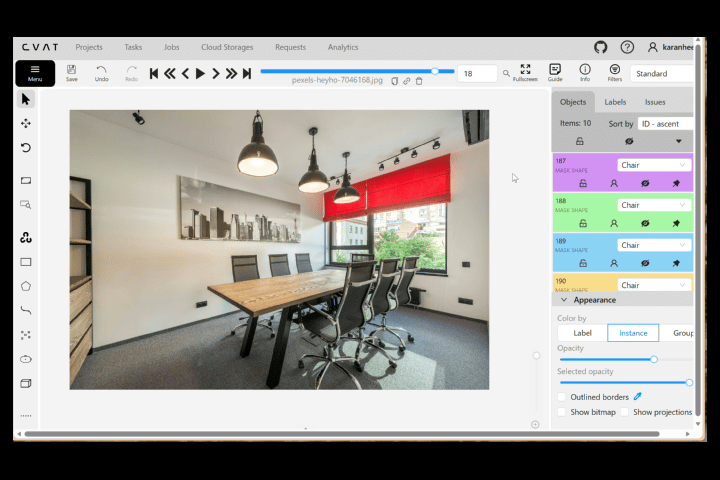

# Semantic Segmentation (Mask-Based) Annotation



This subproject demonstrates **manual Semantic Segmentation using mask-based pixel annotations** created in **CVAT (Computer Vision Annotation Tool)**.

The dataset is exported in **COCO segmentation format**, where all regions are stored as **RLE masks (Run-Length Encoding)**.
A Python notebook analyzes the exported dataset and produces:

* Dataset statistics
* Mask quality validation
* Distribution plots
* A GitHub-ready Markdown report

This project focuses entirely on **annotation quality**, **mask correctness**, and **dataset-level insights**.
No model training is included.

---

## Folder Structure

```plaintext
annotations/
└── annotations.json                # COCO-style RLE masks exported from CVAT

data/
└── GUIDELINES.md                   # Mask-based segmentation annotation guidelines

notebooks/
└── sem_seg_mask_annotations.ipynb  # Analysis, validation, statistics, reporting

results/
├── annotations_stats.txt           # Mask statistics and category counts
├── eval_summary.txt                # RLE mask validation results
├── output.png                      # Category distribution and per-image mask counts
└── report.md                       # GitHub-ready analytical summary

README.md                           # (You are here)
before_after.gif                    # CVAT before/after mask preview
```

---

## About the GIF (Before/After Annotation)

The preview demonstrates:

* The original image
* The corresponding mask-based semantic segmentation overlay
* Pixel-accurate regions from CVAT

It represents the annotation style and consistency followed throughout the dataset.

---

## Tools Used

| Tool / Component | Purpose                                  |
| ---------------- | ---------------------------------------- |
| CVAT             | Manual mask-based semantic segmentation  |
| COCO RLE Format  | Compressed mask representation           |
| Python           | Dataset parsing, validation, aggregation |
| NumPy / Pandas   | Statistical computations                 |
| Matplotlib       | Visual plots & distribution graphs       |
| Jupyter Notebook | Reproducible analysis pipeline           |

---

## Dataset Annotation Details

All annotations were created manually in CVAT using **mask-based pixel labeling**.
The final export is a **COCO 1.0 JSON** file containing:

* Image metadata
* Category definitions
* Mask annotations encoded as RLE strings

The dataset includes diverse scenes:

* Indoor environments (kitchens, libraries, laboratories)
* Outdoor scenes (roads, buildings, parking lots)
* Biological imagery (bacteria, skin lesions)
* Mechanical/electronic parts (chips, transistors, machinery)
* Animals (dog, sheep, penguin)
* Shapes (circles, rectangles, abstract shapes)

The annotation file is located at:

```
annotations/annotations.json
```

---

## Results Generated by the Notebook

Running:

```
notebooks/sem_seg_mask_annotations.ipynb
```

produces four outputs.

### 1. annotations_stats.txt

Extracted directly from your file:

```
=== Annotation Statistics ===

Total Images: 21
Total Annotations: 203
Total Categories: 48
```

### Annotations per Image (exact values):

```
kitchen-7850353_640.jpg: 24
koli-bacteria-123081_640.jpg: 31
lamb-5733685_640.jpg: 4
lawn-mower-4502093_640.jpg: 2
library-488690_640.jpg: 20
lockdown-5061663_640.jpg: 9
london-2928889_640.jpg: 15
main-board-89049_640.jpg: 16
map-11043_640.jpg: 4
mariia-ioffe-Sfs21Re13BU-unsplash.jpg: 7
motor-7903404_640.jpg: 4
operating-room-5979687_640.jpg: 4
parking-lot-4061323_640.jpg: 12
pedestrian-2618280_640.jpg: 5
penguin-8875750_640.jpg: 2
pets-1356191_640.jpg: 4
pexels-brettjordan-2746823.jpg: 2
pexels-hannaauramenka-8409850.jpg: 21
pexels-heyho-7046168.jpg: 10
pexels-samiro-2172137.jpg: 2
pexels-tara-winstead-6692933.jpg: 5
```

### Annotations per Category (exact values):

```
Cabinets: 13
Background: 9
Floor: 5
Chimney: 1
DishWasher: 1
Drawers: 1
Shelf: 1
Sink: 1
Faucet: 1
Oven: 2
Cooktop: 1
Bacteria: 30
Sheep: 2
Trees: 2
Grass: 2
Lawn_Mower: 1
Books: 9
Racks: 9
Person_Carrying: 9
Building: 2
Road: 2
Car: 16
Bus: 3
Sky: 3
Person: 6
Chip: 3
Transistors: 12
Circuit: 1
Vegetation: 2
River: 1
Sea: 1
Land: 1
Skin_Lesions: 6
Skin: 1
Machinery: 2
Boxes: 1
Lights: 1
Table: 2
Parking_Lot: 1
Water: 1
Penguin: 1
Dog: 1
Vinyl: 1
Cirlces: 4
Rectangles: 19
Chair: 7
Hand: 1
Shape: 1
```

### Zero-Area Masks

None were detected.

### Invalid Annotations

No invalid masks or missing segmentations.

---

## 2. eval_summary.txt

Extracted exactly from your file:

```
=== Evaluation Summary (Basic Quality Checks) ===

Zero area annotations: 0
Invalid annotations: 0
Mean mask area: 714780.35
Median mask area: 12382.00
Max mask area: 24674684.00
```

These checks confirm structural validity of all mask entries.

---

## 3. output.png

A combined visualization showing:

* Annotation count per category
* Annotation count per image

This offers a quick overview of dataset balance and labeling density.
Shown below:


---

## 4. report.md

A finalized Markdown report summarizing:

* Total images, total masks, total categories
* Per-category mask counts
* Per-image mask counts
* Mask area statistics
* Validation summaries
* Embedded distribution figure

Useful for GitHub, documentation, or dataset audit records.

---

## Annotation Guidelines

The full annotation rules used for mask creation are documented in:

```
data/GUIDELINES.md
```

This includes:

* Visual-boundary mask rules
* Visible-only annotation policy
* How to treat occlusions
* Stuff vs. object category guidance
* Consistency rules
* Small-object, reflection, and transparency handling
* Dataset-wide mask quality standards

---

## Example Visualization

From `results/output.png`, the summary plot reveals:

* Heavy representation of Bacteria, Cabinets, Books, Racks, Rectangles
* Sparse categories (1–2 annotations each) like Skin, Penguin, Vinyl, Sea, Oven
* Highly varied annotation density across images

This is consistent with the multi-domain nature of the dataset.

---

## About the Project

This mask-based segmentation project demonstrates:

* Accurate pixel-level annotation across 21 diverse images
* Experience with COCO RLE-masked segmentation exports
* Custom dataset validation and statistics pipelines
* Consistent multi-class segmentation across 48 categories
* No dependence on models — purely focused on manual annotation quality
* Fully reproducible workflows using Jupyter

---

## Author

Karan Heera

GitHub: [https://github.com/karanheera](https://github.com/karanheera)
LinkedIn: [https://linkedin.com/in/karanheera](https://linkedin.com/in/karanheera)

---

## Summary

This repository showcases:

* Manual mask-based annotation proficiency
* Understanding of COCO mask structures (RLE)
* Dataset validation and quality checks
* Statistical dataset breakdowns
* Documentation and reporting best practices

A complete annotation-only workflow suitable for research, dataset creation, training data preparation, or annotation portfolio demonstration.

---

## Special Thanks & Image Credits

Images sourced from:

* Pexels — [https://www.pexels.com](https://www.pexels.com)
* Pixabay — [https://pixabay.com](https://pixabay.com)
* Unsplash — [https://unsplash.com](https://unsplash.com)

Used strictly under their respective free-to-use licenses for non-commercial annotation research and educational purposes.


