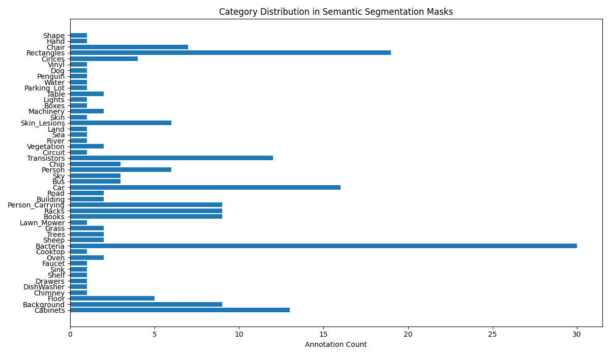

# Semantic Segmentation Mask Annotation Report
Generated automatically from CVAT COCO annotations.

## Dataset Summary
- **Images:** 21
- **Annotations:** 203
- **Categories:** 48

## Annotation Quality Checks
- Zero Area Masks: **0**
- Invalid Annotations: **0**

## Distribution Plot

## Notes
- All masks analyzed are RLE (Run-Length Encoding) from CVAT Mask Brush.
- No images were loaded or displayed.
- No model training performed.
