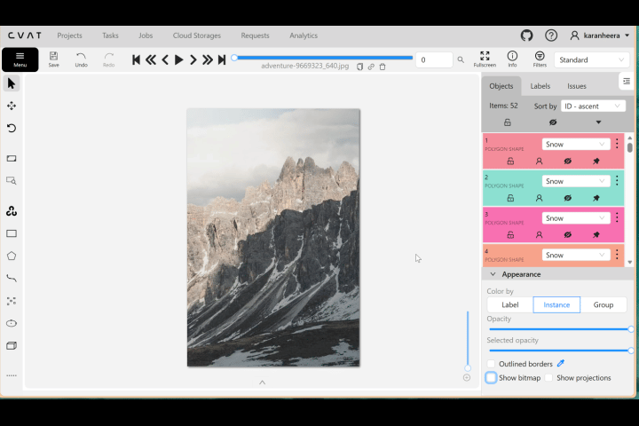
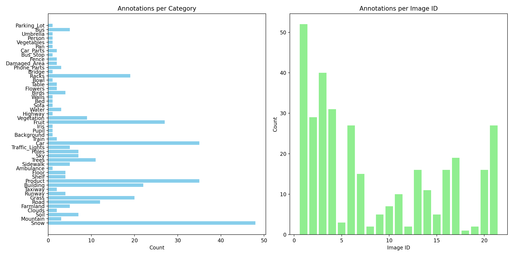

# Semantic Segmentation (Polygon-Based) Annotation



This subproject demonstrates **manual Semantic Segmentation annotation using polygon masks** created in **CVAT (Computer Vision Annotation Tool)**.

The annotated dataset is exported in **COCO-style JSON format**, and analyzed through a Python notebook to produce:

- **Statistical summaries**
- **Validation checks**
- **Distribution plots**
- **A GitHub-ready Markdown report**

> ⚙️ **No model training is performed.**  
> This project focuses on **the annotation workflow**, **polygon quality**, and **dataset-level analysis**.

---

## 📁 Folder Structure

```plaintext
annotations/
└── annotations.json          # COCO-style segmentation export from CVAT

data/
└── GUIDELINES.md             # Detailed polygon annotation guidelines

notebooks/
└── sem_seg_polygon_annotations.ipynb   # Analysis, validation, statistics, report

results/
├── annotations_stats.txt     # Annotation statistics
├── eval_summary.txt          # Polygon validation & metadata checks
├── output.png                # Category & image distribution plot
└── report.md                 # GitHub-ready summary report

README.md                     # (You are here)
before_after.gif             # CVAT annotation before/after preview
````

---

## About the GIF (Before/After Annotation)

The GIF at the top shows:

* **Original input image (before)**
* **Polygon segmentation masks (after)**
* Exported directly from **CVAT**, demonstrating manual polygon tracing used throughout the project.

This preview represents the annotation style, precision, and category coverage used during the process.

---

## Tools Used

| Component      | Purpose                                                |
| -------------- | ------------------------------------------------------ |
| **CVAT**       | Manual polygon-based semantic segmentation annotations |
| **COCO JSON**  | Standard export format containing polygon + metadata   |
| **Python**     | Parsing, analysis, validation, and reporting           |
| **Matplotlib** | Plot generation for annotation statistics              |
| **Jupyter**    | Notebook workflow for reproducible analysis            |

---

## Dataset Annotation Details

All annotations were created **manually in CVAT** using polygon tools:

* Each region is outlined using **segmentation polygons**
* Categories include **49 semantic classes** (e.g., Road, Grass, Car, Building, etc.)
* Exported using:
  **CVAT → Export Dataset → COCO 1.0 → Segmentation format**

Example CVAT annotations include:

* Outdoor scenes (roads, sky, trees, cars)
* Indoor scenes (products, shelves, bowls, racks)
* Aerial/drone scenes (snow, mountains, farmland)
* Human-related labels (person, pupil, iris)
* Misc-specific categories (phone parts, damaged area)

The exported file is stored at:

```
annotations/annotations.json
```

---

## What the Notebook Generates

Running the notebook:

```
notebooks/sem_seg_polygon_annotations.ipynb
```

produces:

### 1. annotations_stats.txt

Includes:

* Total images: 21
* Total annotations: 336
* Category frequency table
* Annotation counts per image
* Polygon area stats (min, mean, max)

### 2. eval_summary.txt

Automated validation checks:

* Missing file names
* Polygon structural validity
* Odd number of coordinates
* Zero-area or invalid shapes

*(In dataset, all polygons are valid.)*

### 3. output.png

A combined visualization containing:

* **Bar chart: annotations per category**
* **Bar chart: annotations per image**

### 4. report.md

A clean Markdown report summarizing:

* Dataset metadata
* Category distribution
* Area statistics
* Validation summary
* Embedded output plot

---

## ▶️ How to Run the Project

1. Navigate to the project directory:

```bash
cd <project-folder>
```

2. Install dependencies:

```bash
pip install numpy matplotlib pandas jupyter
```

3. Launch the Jupyter notebook:

```bash
jupyter notebook notebooks/sem_seg_polygon_annotations.ipynb
```

4. Run all cells to:

* Load `annotations.json`
* Validate polygons
* Compute statistics
* Create output plots
* Generate `results/report.md`

---

## 🧪 Sample Numbers (From This Dataset)

**Total Images:** 21
**Total Categories:** 49
**Total Polygons:** 336
**Largest Annotation Area:** 614,400 px
**Smallest Annotation Area:** 4 px

Most common labels:

* Snow (48)
* Car (35)
* Product (35)
* Fruit (27)
* Racks (19)

Least common labels (1 each):

* Ambulance
* Pupil
* Iris
* Highway
* Sofa
* Bed
* Walls
* Bowl
* Vegetables
* Person
* Umbrella
* Parking_Lot

---

## Annotation Guidelines

Detailed polygon rules, edge cases, category descriptions, and CVAT best practices are provided in:

```
data/GUIDELINES.md
```

This file explains:

* How to outline objects
* How to handle occlusions
* Visible-only annotation policy
* Reflection/shadow rules
* Handling transparency
* Multi-object boundaries
* Consistency rules for all annotators

---

## Example Visualization (from `output.png`)

### Annotation Summary Plot
Below is the combined graph showing:
- Annotation count per category
- Annotation count per image ID




---

## About the Project

This annotation task demonstrates:

* Expertise with **CVAT polygon tools**
* Understanding of **COCO segmentation format**
* Ability to analyze and validate segmentation datasets
* Clean, reproducible notebook workflows
* High-quality manual segmentation across 21 diverse images
* Thorough reporting & statistical breakdowns
* No GPU or model training required — purely annotation-focused

---

## Author

**Karan Heera**

🌐 GitHub: [https://github.com/karanheera/](https://github.com/karanheera/)
🔗 LinkedIn: [https://linkedin.com/in/karanheera/](https://linkedin.com/in/karanheera/)

---

## Summary

This project highlights strong skills in:

* **Semantic Segmentation annotation (manual)**
* **Polygon mask creation in CVAT**
* **Dataset validation and quality checking**
* **COCO segmentation structure**
* **Automated reporting & visualization**

A complete, professional, annotation-only workflow for computer vision segmentation datasets.

## 📸 Special Thanks & Image Credits

This semantic segmentation project was made possible using a curated set of images sourced manually from:

- **Pexels** — https://www.pexels.com  
- **Pixabay** — https://pixabay.com  
- **Unsplash** — https://unsplash.com  

These platforms provide high-quality, royalty-free images contributed by talented photographers worldwide.  
I am thankful to every photographer and creator whose work enabled the annotation tasks in this project.

> All images were used strictly under their respective free-to-use licenses for non-commercial, educational, and annotation research purposes.
