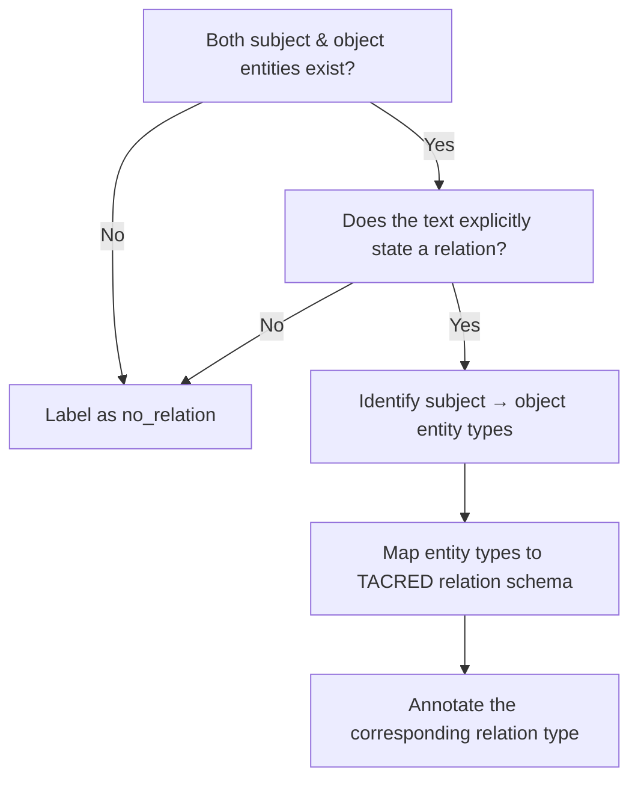

# Relation Extraction (RE) Annotation Guidelines

These guidelines describe how to annotate text data for **relation extraction (RE)**.
The goal is to identify **relations between entities** in a sentence and assign the correct relation type from the predefined schema (TACRED 42 relations + `no_relation`).

---

## 1. Entity Types

Entities are the **building blocks** for relations. Only annotate relations **between valid entities**.

| Entity             | Meaning           | Example                 |
| ------------------ | ----------------- | ----------------------- |
| **PER**            | Person            | *“Barack Obama”*        |
| **ORG**            | Organization      | *“Microsoft”*           |
| **LOC**            | Location          | *“Europe”*              |
| **CITY**           | City              | *“New York”*            |
| **STATE/PROVINCE** | State or province | *“California”*          |
| **COUNTRY**        | Country           | *“USA”*                 |
| **TITLE**          | Job title or role | *“CEO”*                 |
| **DATE**           | Date              | *“January 1, 2020”*     |
| **DATETIME**       | Date with time    | *“2020-01-01 10:00 AM”* |
| **NUM**            | Numeric value     | *“50 employees”*        |
| **None**           | No valid entity   | *Leave blank or ignore* |

> ⚠️ Only annotate relations **between these entity types**. If an entity is missing or unclear, do **not guess**.

---

## 2. Relation Types

Relations are directed edges **from a subject entity to an object entity**.

| Relation                                | Description                             | Subject → Object               |
| --------------------------------------- | --------------------------------------- | ------------------------------ |
| **org:founded_by**                      | Organization founded by a person        | ORG → PER                      |
| **org:founded**                         | Person founded an organization          | PER → ORG                      |
| **per:city_of_birth**                   | City where person was born              | PER → CITY                     |
| **per:stateorprovince_of_birth**        | State/province of birth                 | PER → STATE/PROVINCE           |
| **per:country_of_birth**                | Country of birth                        | PER → COUNTRY                  |
| **per:date_of_death**                   | Date of death                           | PER → DATE                     |
| **per:stateorprovince_of_death**        | State/province of death                 | PER → STATE/PROVINCE           |
| **per:country_of_death**                | Country of death                        | PER → COUNTRY                  |
| **per:age**                             | Age                                     | PER → NUM                      |
| **per:schools_attended**                | Schools or universities attended        | PER → ORG                      |
| **per:employee_of**                     | Person employed by organization         | PER → ORG                      |
| **per:title**                           | Person’s job title                      | PER → TITLE                    |
| **per:spouse**                          | Person’s spouse                         | PER → PER                      |
| **per:children**                        | Person’s children                       | PER → PER                      |
| **per:parents**                         | Person’s parents                        | PER → PER                      |
| **per:siblings**                        | Person’s siblings                       | PER → PER                      |
| **per:religion**                        | Person’s religion                       | PER → ORG / other if specified |
| **per:cities_of_residence**             | Cities person resides in                | PER → CITY                     |
| **per:stateorprovinces_of_residence**   | States/provinces of residence           | PER → STATE/PROVINCE           |
| **org:city_of_headquarters**            | Organization HQ city                    | ORG → CITY                     |
| **org:stateorprovince_of_headquarters** | Organization HQ state/province          | ORG → STATE/PROVINCE           |
| **org:country_of_headquarters**         | Organization HQ country                 | ORG → COUNTRY                  |
| **org:top_members/employees**           | Key personnel                           | ORG → PER                      |
| **org:members**                         | Organization members                    | ORG → PER                      |
| **org:number_of_employees/members**     | Numeric count of employees              | ORG → NUM                      |
| **org:subsidiaries**                    | Subsidiary organizations                | ORG → ORG                      |
| **org:parents**                         | Parent organizations                    | ORG → ORG                      |
| **org:member_of**                       | Organization membership                 | ORG → ORG                      |
| **org:shareholders**                    | Shareholders of organization            | ORG → PER / ORG                |
| **org:political/religious_affiliation** | Political or religious affiliation      | ORG → ORG                      |
| **org:alternate_names**                 | Alternative names of organization       | ORG → ORG                      |
| **org:dissolved**                       | Organization dissolution date           | ORG → DATE                     |
| **no_relation**                         | No meaningful relation between entities | Any entity pair                |

> ⚠️ Always assign **`no_relation`** if no explicit relation exists, even if entities co-occur.

---

## 3. General Annotation Rules

1. **Direction matters**:
   Example: `org:founded_by` ≠ `org:founded`. Always label **subject → object** correctly.

2. **Only annotate explicit relations**:
   Don’t infer relations beyond what the text directly states.

3. **Entity boundaries**:
   Make sure the entity spans are correct. Partial entities or pronouns may need resolution only if contextually clear.

4. **No overlapping relations**:
   Each pair of entities gets **one relation label**. If multiple relations exist, annotate all separately.

5. **Consistency**:
   Use the same rules for similar patterns across sentences.

---

## 4. Context and Disambiguation

Some relations may look similar. Follow these rules:

| Confusing Cases                                   | Rule                                                                                                                                          |
| ------------------------------------------------- | --------------------------------------------------------------------------------------------------------------------------------------------- |
| `per:employee_of` vs. `org:top_members/employees` | Focus on the sentence: if describing person → organization, use `per:employee_of`; if organization → person, use `org:top_members/employees`. |
| `per:city_of_birth` vs. `per:cities_of_residence` | Birth = birthplace only; residence = current or past living location.                                                                         |
| Multiple possible objects                         | Annotate **all valid relations** separately.                                                                                                  |
| Implicit mentions                                 | Only annotate if clearly implied by text, otherwise `no_relation`.                                                                            |

---

## 5. Tricky Cases

| Example                                   | Correct Relation                       | Notes                                    |
| ----------------------------------------- | -------------------------------------- | ---------------------------------------- |
| “Bill Gates founded Microsoft.”           | PER → ORG → `org:founded`              | Subject = Bill Gates, Object = Microsoft |
| “Microsoft was founded by Bill Gates.”    | ORG → PER → `org:founded_by`           | Direction reversed                       |
| “Barack Obama was born in Honolulu.”      | PER → CITY → `per:city_of_birth`       | Exact city required                      |
| “The company dissolved in 2010.”          | ORG → DATE → `org:dissolved`           | Explicit dissolution date                |
| “John lives in New York and Los Angeles.” | PER → CITY → `per:cities_of_residence` | Multiple objects possible                |
| “Alice is Bob’s sister.”                  | PER → PER → `per:siblings`             | Family relations                         |

---

## 6. Annotation Workflow

1. **Identify entities** in the sentence.
2. **Pair each subject entity with each object entity**.
3. **Decide if a relation exists**. If none, label `no_relation`.
4. **Assign the correct relation type** from the schema.
5. **Review your annotations** for consistency and correctness.

---

## 7. Relation Decision Flowchart

**How to use the flowchart:**

1. Check **entity validity**.
2. Check **explicit relation**.
3. Identify **entity types** (subject → object).
4. Map to **TACRED relation**.
5. Use `no_relation` if none exists.

---

## 8. Quality Control

* Randomly check **5–10%** of labeled sentences.
* Resolve disagreements between multiple annotators.
* Track difficult examples and update guidelines if needed.
* Maintain **inter-annotator agreement** metrics if more than one annotator is working.

---

## 9. Summary Table

| Rule                        | Description                            |
| --------------------------- | -------------------------------------- |
| 1. Correct entity labeling | Use proper entity types                |
| 2. Direction matters       | Always subject → object                |
| 3. Only explicit relations | Don’t infer beyond text                |
| 4. Use `no_relation`       | When no relation exists                |
| 5. Be consistent           | Apply same rules across dataset        |
| 6. Document edge cases     | Update guidelines with tricky examples |
| 7. Review for quality      | Random checks and agreement            |

