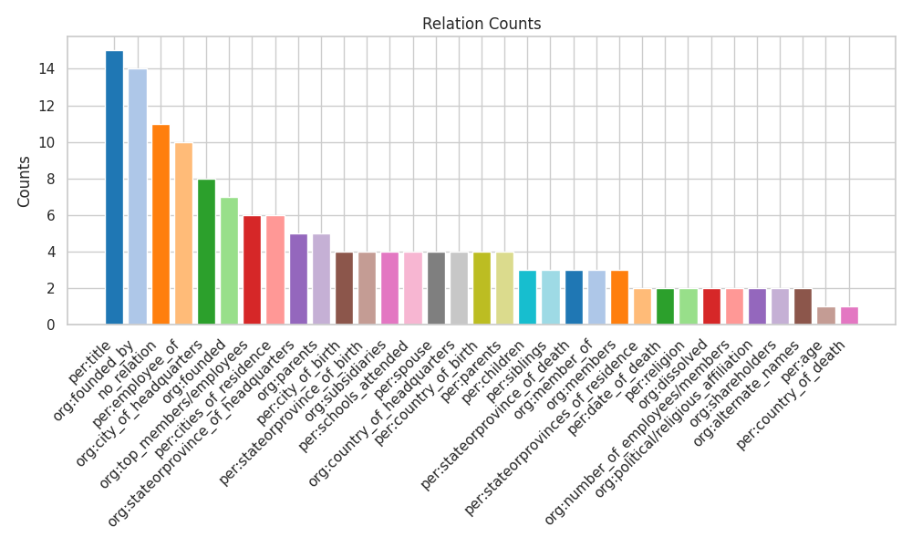
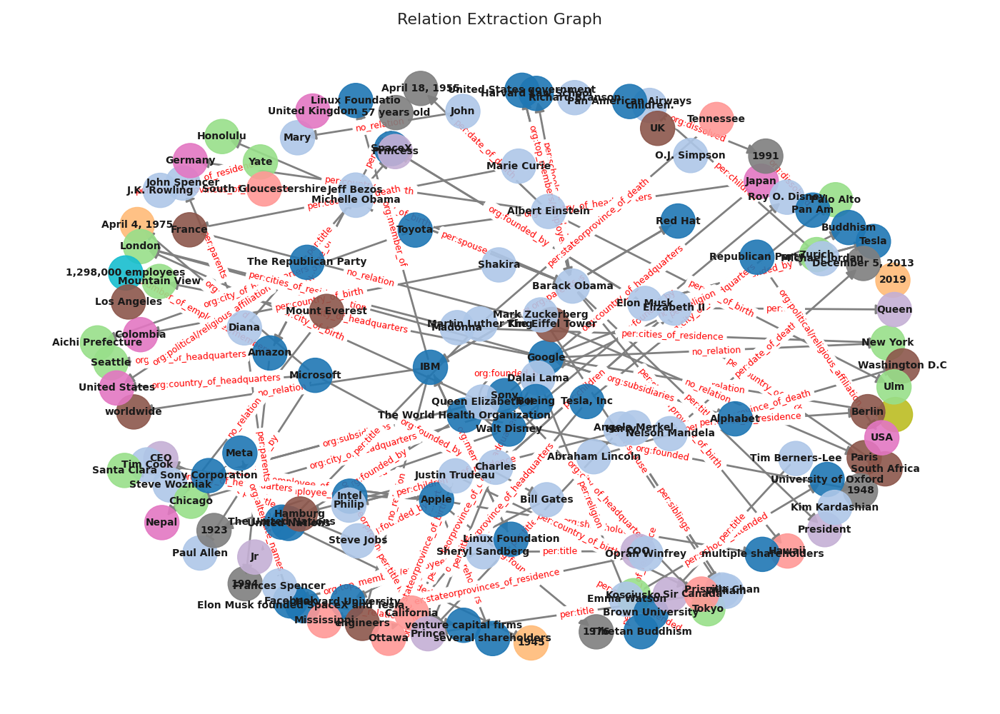

# Relation Extraction Annotation Report

## Summary Statistics

- Number of annotation tasks: 100
- Number of entities: 239
- Number of relations: 152
- Entity labels: ORG, PER, DATE, CITY, STATE/PROVINCE, TITLE, LOC, COUNTRY, DATETIME, None, NUM
- Relation types: org:founded_by, org:founded, per:city_of_birth, per:stateorprovince_of_birth, org:city_of_headquarters, org:stateorprovince_of_headquarters, org:top_members/employees, per:employee_of, per:title, per:cities_of_residence, per:stateorprovinces_of_residence, org:parents, org:subsidiaries, no_relation, per:schools_attended, per:spouse, org:country_of_headquarters, per:date_of_death, per:children, per:country_of_birth, per:parents, per:religion, per:siblings, per:stateorprovince_of_death, org:dissolved, org:member_of, org:members, org:number_of_employees/members, org:political/religious_affiliation, org:shareholders, per:age, per:country_of_death, org:alternate_names

## Entity Counts

## Relation Counts

## Relation Graph

