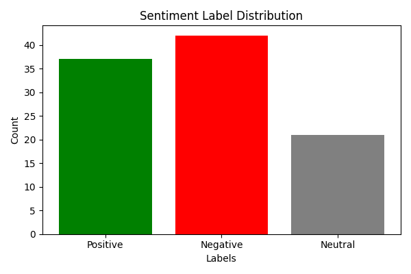

# Sentiment Analysis Annotation Text Classification

This subproject demonstrates **skills in sentiment analysis text classification** using **[Label Studio](https://labelstud.io/)**, with steps for **data visualization, evaluation, and report generation**.

> ⚙️ No model training is performed — this project focuses purely on the **manual annotation process**, **data quality assessment**, and **visual analysis** of sentiment-labeled text.

---

## 📁 Folder Structure

```plaintext
annotations/
└── train.json              # Labeled data exported from Label Studio (JSON format)

data/
├── GUIDELINES.md           # Annotation guidelines for sentiment labeling
└── sentiment_texts.csv     # Randomly generated text samples for annotation

notebooks/
└── sentiment_annotations.ipynb  # Main notebook: visualize, evaluate & generate report

results/
├── annotations_stats.txt   # Label counts and basic statistics
├── eval_summary.txt        # Annotation evaluation summary
├── label_distribution.png  # Bar chart of sentiment label distribution
└── report.md               # GitHub-ready summary report

README.md                   # (You are here)
```

---

## 📂 Data Folder

The `data/` folder contains the source text samples and annotation guidelines:

```plaintext
data/
├── GUIDELINES.md
└── sentiment_texts.csv
```

> ⚠️ **Note:**
>
> * The text samples in `sentiment_texts.csv` were **generated using ChatGPT prompts** to simulate realistic casual text suitable for sentiment annotation.
> * 100 text samples were imported into **Label Studio** and **annotated manually** with labels: `Positive`, `Negative`, `Neutral`.
> * `GUIDELINES.md` contains instructions for annotators, including label definitions, annotation best practices, and handling edge cases.

---

## Tools Used

| Component            | Purpose                                                |
| -------------------- | ------------------------------------------------------ |
| **Label Studio**     | Manual sentiment labeling                              |
| **JSON Format**      | Standard structured data export                        |
| **Python + Jupyter** | For processing, analysis, visualization, and reporting |
| **Matplotlib**       | Visualization of label distribution                    |

---

## How to Run

1. **Navigate to the project folder**:

   ```bash
   cd <project-folder>
   ```

2. **Install dependencies**:

   ```bash
   pip install matplotlib jupyter
   ```

3. **Open the notebook**:

   ```bash
   jupyter notebook notebooks/sentiment_annotations.ipynb
   ```

4. **Run all cells**:

   * Reads `annotations/train.json` (exported from Label Studio)
   * Computes annotation statistics
   * Generates plots and reports:

     * `results/annotations_stats.txt`
     * `results/eval_summary.txt`
     * `results/label_distribution.png`
     * `results/report.md`

---

## About the Annotations

All sentiment labels were created in **Label Studio**, using the text classification interface. Expected labels:

* `Positive`
* `Negative`
* `Neutral`

> **Annotation skill highlight:** 100 text samples were labeled manually in **approximately 5 minutes**, demonstrating speed, accuracy, and familiarity with text classification workflows.

---

## Before & After Example

| Stage                       | Description                    | Example                                                                                                                                                                              |
| --------------------------- | ------------------------------ | ------------------------------------------------------------------------------------------------------------------------------------------------------------------------------------ |
| **Before Annotation**       | Raw text                       | `I’m excited to start my photography course soon.`                                                                                                                                   |
| **After Annotation (JSON)** | Labeled JSON from Label Studio | <pre>{ "data": {"text": "I’m excited to start my photography course soon."}, "annotations": [{"result": [{"value": {"choices": ["Positive"]}}]}] }</pre>                             |
| **Visualization**           | Label distribution plot        |                                                                                                                                 |
| **Random Sample Texts**     | Example texts per label        | **Positive:** I’m so excited to see my favorite band live! <br> **Negative:** The soup was too salty for my taste. <br> **Neutral:** We finally finished decorating the living room. |

---

## Example Evaluation Summary

**`results/eval_summary.txt`:**

```plaintext
Total annotations: 100
Missing labels: 0
Unexpected labels: []
Missing texts: 0
Duplicate texts: 0
Text length (words) - min: 5, max: 11, avg: 7.79
```

---

## Generated Report

After running the notebook, `results/report.md` is automatically generated. It includes:

* Total annotations and label counts
* Label distribution percentages
* Missing, unexpected, and duplicate text statistics
* Text length statistics
* Random sample texts per sentiment label
* Inline visualization of label distribution

**Example snippet from `report.md`:**

```markdown
# Sentiment Annotation Report

Total annotations: **100**

## Label Counts
- **Positive**: 37 (37.00%)
- **Negative**: 42 (42.00%)
- **Neutral**: 21 (21.00%)

## Random Sample Texts by Label

### Neutral
- She shared a touching story about her grandmother.
- We finally finished decorating the living room.

### Positive
- I’m excited to start my photography course soon.
- I’m so excited to see my favorite band live!

### Negative
- He forgot to save his work before the computer crashed.
- The soup was too salty for my taste.

## Label Distribution Plot

```

---

## Technologies Used

* **Python 3.9+**
* **Label Studio** — for manual text classification
* **Matplotlib** — for visualization
* **Jupyter Notebook** — for analysis and reporting

---

## Author

**Karan Heera**

🌐 [GitHub](https://github.com/karanheera/) • [LinkedIn](https://linkedin.com/in/karanheera/)

---

## 🏁 Summary

This Sentiment Analysis Annotation demonstrates:

* Practical **text classification dataset creation** using Label Studio.
* Ability to **analyze and visualize annotation statistics**.
* **Automated evaluation and reporting** for annotation quality.
* Strong understanding of **label consistency and data structure**.
* Efficient annotation workflow
* Inline **visualization of sentiment distribution** for reporting and validation.
* Use of **ChatGPT-generated sample texts** for annotation practice.
* Clear **Before & After examples** with visualization and JSON annotation structure.
