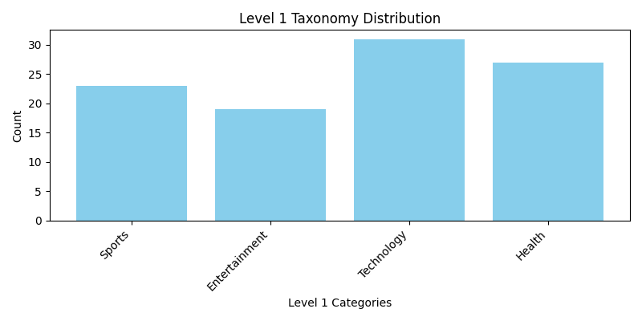
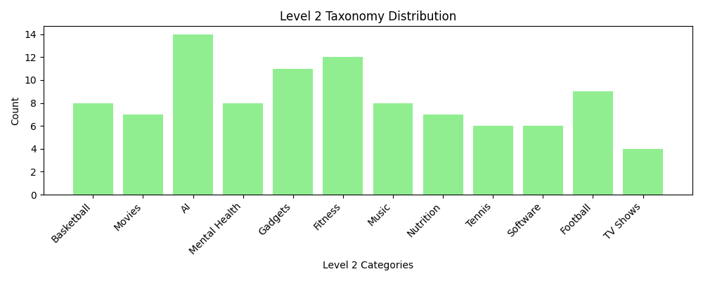

# Taxonomy-Based Text Classification Annotation

This subproject demonstrates **skills in taxonomy-based text classification data annotation** using **[Label Studio](https://labelstud.io/)**, with **manual annotation**, **statistical analysis**, **visualization**, and **report generation**.

> ⚙️ No model training is performed — the focus is purely on **manual annotation**, **data quality analysis**, and **taxonomy distribution insights**.

---

## 📁 Folder Structure

```plaintext
annotations/
└── train.json             # Labeled data exported from Label Studio (JSON format)

data/
├── GUIDELINES.md          # Annotation guidelines for taxonomy classification
└── taxonomy_texts.csv     # Randomly generated text samples for annotation

notebooks/
└── taxonomy_annotations.ipynb  # Main notebook: analyze, visualize & generate report

results/
├── annotations_stats.txt  # Annotation statistics and consistency checks
├── eval_summary.txt       # Evaluation summary of annotation completeness
├── level1_distribution.png # Level 1 taxonomy distribution chart
├── level2_distribution.png # Level 2 taxonomy distribution chart
└── report.md              # GitHub-ready annotation report

README.md                  # (You are here)
```

---

## 📂 Data Folder

The `data/` folder contains:

```plaintext
data/
├── GUIDELINES.md
└── taxonomy_texts.csv
```

> ⚠️ **Note:**
>
> * `taxonomy_texts.csv` contains randomly generated text samples suitable for taxonomy annotation.
> * 100 of these samples were **manually annotated** using **Label Studio**.
> * `GUIDELINES.md` defines the **taxonomy hierarchy**, annotation rules, and instructions for annotators.

---

## Tools Used

| Component               | Purpose                                                   |
| ----------------------- | --------------------------------------------------------- |
| **Label Studio**        | Manual taxonomy-based annotation                          |
| **JSON Format**         | Standard structured data export from Label Studio         |
| **Python + Jupyter**    | Data processing, statistics, visualization, and reporting |
| **Matplotlib**          | Visualization of taxonomy distributions                   |
| **collections.Counter** | Counting label occurrences and calculating statistics     |

---

## How to Run

1. **Navigate to the project folder**

   ```bash
   cd <project-folder>
   ```

2. **Install dependencies**

   ```bash
   pip install matplotlib jupyter
   ```

3. **Open the notebook**

   ```bash
   jupyter notebook notebooks/taxonomy_annotations.ipynb
   ```

4. **Run all cells**

   * Reads `annotations/train.json` (exported from Label Studio)
   * Extracts Level 1 and Level 2 taxonomy labels
   * Generates:

     * `results/annotations_stats.txt`
     * `results/eval_summary.txt`
     * `results/level1_distribution.png`
     * `results/level2_distribution.png`
     * `results/report.md`

---

## About the Annotations

All annotations were created in **Label Studio**, using the **taxonomy interface** to tag hierarchical categories (Level 1 → Level 2). Example taxonomy levels include:

* **Level 1:** Sports, Entertainment, Technology, Health
* **Level 2 (examples):** Basketball, Movies, AI, Fitness, Gadgets, Music

> **Annotation skill highlight:** 100 text samples were annotated **manually with 100% completeness**, demonstrating accuracy, attention to hierarchical consistency, and familiarity with Label Studio workflows.

---

## Annotation Statistics

**`results/annotations_stats.txt` snippet:**

```plaintext
Total annotations: 100

Level 1 Taxonomy Counts:
- Sports: 23
- Entertainment: 19
- Technology: 31
- Health: 27

Level 2 Taxonomy Counts:
- Basketball: 8
- Movies: 7
- AI: 14
- Mental Health: 8
...

Annotation completeness: 100.00%
Missing taxonomy labels: 0
Duplicate texts: 0
Inconsistent taxonomy pairs: 0
Text length (words) - min: 7, max: 15, avg: 9.63
```

**Insights:**

* **Balanced Level 1 distribution:** Technology is the largest category (31%), followed by Health, Sports, and Entertainment.
* **No incomplete or missing annotations:** Demonstrates high-quality manual labeling.
* **Consistent taxonomy hierarchy:** No invalid parent-child pairs found.

---

## Example Evaluation Summary

**`results/eval_summary.txt` snippet:**

```plaintext
Evaluation Summary (Taxonomy Annotations)
-------------------------------------------
Total annotations: 100
Incomplete annotations: 0
Annotation completeness: 100.00%
Missing taxonomy labels: 0
Missing texts: 0
Duplicate texts: 0
Inconsistent taxonomy pairs: 0
Text length (words) - min: 7, max: 15, avg: 9.63
```

> ✅ Confirms complete, consistent, and high-quality manual annotation.

---

## Visualizations

**Taxonomy Distribution Charts:**

* **Level 1 Taxonomy Distribution**
  

* **Level 2 Taxonomy Distribution**
  

> Charts help visualize category balance and identify potential annotation imbalances.

---

## Generated Report

**`results/report.md` highlights:**

* Level 1 and Level 2 taxonomy counts
* Annotation completeness and consistency
* Imbalance ratios vs. largest class
* Random sample texts by Level 1 category
* Distribution plots

**Example snippet:**

```markdown
### Technology
- Software solutions are being developed to enhance cybersecurity.
- AI-driven analytics are helping software companies optimize their products.
- Gadgets like smart speakers are becoming central to home automation.
...
```

---

## Technologies Used

* **Python 3.9+**
* **Label Studio** — for manual taxonomy annotation
* **Jupyter Notebook** — for data analysis, reporting, and visualization
* **Matplotlib** — for distribution charts
* **collections.Counter** — for counting labels and checking annotation statistics

---

## Author

**Karan Heera**

🌐 [GitHub](https://github.com/karanheera/) • [LinkedIn](https://linkedin.com/in/karanheera/)

---

## 🏁 Summary

This Taxonomy-Based Text Classification project demonstrates:

* Manual **hierarchical taxonomy annotation** with Label Studio.
* Extraction and **analysis of Level 1 and Level 2 labels**.
* **Evaluation of annotation completeness and consistency**.
* Visualization of category distributions for reporting.
* **Efficient and high-quality annotation workflow**, producing ready-to-use labeled data.
* Handling **randomly generated sample texts** for practice and testing taxonomy annotation pipelines.

